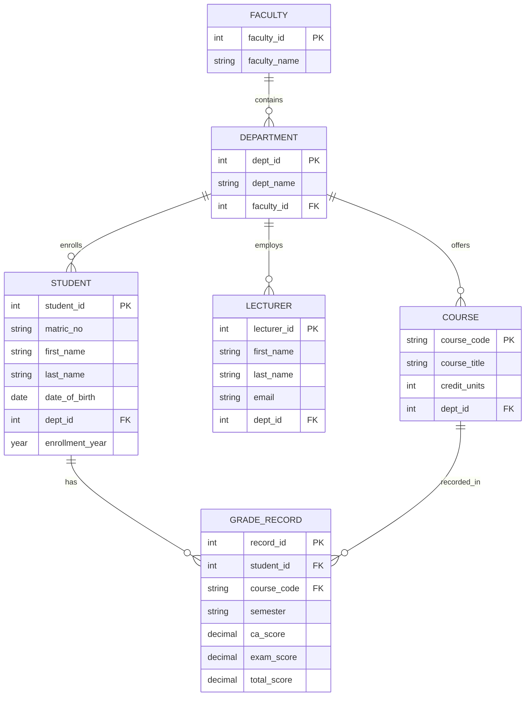

```mermaid
erDiagram
    FACULTY ||--o{ DEPARTMENT : "contains"
    DEPARTMENT ||--o{ STUDENT : "enrolls"
    DEPARTMENT ||--o{ LECTURER : "employs"
    DEPARTMENT ||--o{ COURSE : "offers"
    STUDENT ||--o{ GRADE_RECORD : "has"
    COURSE ||--o{ GRADE_RECORD : "recorded_in"

    FACULTY {
        int faculty_id PK
        string faculty_name
    }
    DEPARTMENT {
        int dept_id PK
        string dept_name
        int faculty_id FK
    }
    STUDENT {
        int student_id PK
        string matric_no
        string first_name
        string last_name
        date date_of_birth
        int dept_id FK
        year enrollment_year
    }
    LECTURER {
        int lecturer_id PK
        string first_name
        string last_name
        string email
        int dept_id FK
    }
    COURSE {
        string course_code PK
        string course_title
        int credit_units
        int dept_id FK
    }
    GRADE_RECORD {
        int record_id PK
        int student_id FK
        string course_code FK
        string semester
        decimal ca_score
        decimal exam_score
        decimal total_score
    }
```
